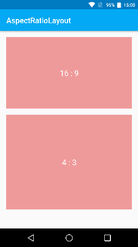

# Android - AspectRatioLayout

[](https://developer.android.com)
[](https://central.sonatype.com/artifact/io.github.takwolf.android.aspectratiolayout/aspectratiolayout)

A simple aspect ratio layout for Android.

## Screenshot



## Snippets

```kotlin
implementation("io.github.takwolf.android.aspectratiolayout:aspectratiolayout:0.0.0")
```

## Usage

```xml
<com.takwolf.android.aspectratiolayout.AspectRatioLayout
    android:layout_width="match_parent"
    android:layout_height="wrap_content"
    app:arl_widthRatio="4"
    app:arl_heightRatio="3">

    <YourView />
    
</com.takwolf.android.aspectratiolayout.AspectRatioLayout>
```

That's it!

PS: `AspectRatioLayout` is extends `FrameLayout`.

## Another way

There is another way to make aspect ratio layout by [ConstraintLayout](https://developer.android.google.cn/develop/ui/views/layout/constraint-layout) like:

```xml
<androidx.constraintlayout.widget.ConstraintLayout
    android:layout_width="match_parent"
    android:layout_height="match_parent">
    
    <View 
        android:layout_width="match_parent"
        android:layout_height="wrap_content"
        android:background="?colorPrimary"
        app:layout_constraintTop_toTopOf="parent"
        app:layout_constrainedHeight="true"
        app:layout_constraintDimensionRatio="16:9" />

</androidx.constraintlayout.widget.ConstraintLayout>
```

## License

[Apache License 2.0](LICENSE)
