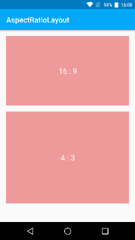

# Android - AspectRatioLayout

[](https://developer.android.com)
[](https://android-arsenal.com/api?level=21)
[](https://www.apache.org/licenses/LICENSE-2.0)
[](https://jitpack.io/#TakWolf/Android-AspectRatioLayout)

A simple aspect ratio layout for Android.

## Screenshot



## Usage

```kotlin
repositories {
    maven { setUrl("https://jitpack.io") }
}

dependencies {
    implementation("com.github.TakWolf:Android-AspectRatioLayout:0.0.1")
}
```

```xml
<com.takwolf.android.aspectratiolayout.AspectRatioLayout
    android:layout_width="match_parent"
    android:layout_height="wrap_content"
    app:arl_widthRatio="4"
    app:arl_heightRatio="3">

    <YourView />
    
</com.takwolf.android.aspectratiolayout.AspectRatioLayout>
```

That's it!

PS: `AspectRatioLayout` is extends `FrameLayout`.

## Another way

There is another way to make aspect ratio layout by [ConstraintLayout](https://developer.android.google.cn/training/constraint-layout) like:

```xml
<androidx.constraintlayout.widget.ConstraintLayout
    android:layout_width="match_parent"
    android:layout_height="match_parent">
    
    <View 
        android:layout_width="match_parent"
        android:layout_height="wrap_content"
        android:background="?colorPrimary"
        app:layout_constraintTop_toTopOf="parent"
        app:layout_constrainedHeight="true"
        app:layout_constraintDimensionRatio="16:9" />

</androidx.constraintlayout.widget.ConstraintLayout>
```

## License

```
Copyright 2022 TakWolf

Licensed under the Apache License, Version 2.0 (the "License");
you may not use this file except in compliance with the License.
You may obtain a copy of the License at

    http://www.apache.org/licenses/LICENSE-2.0

Unless required by applicable law or agreed to in writing, software
distributed under the License is distributed on an "AS IS" BASIS,
WITHOUT WARRANTIES OR CONDITIONS OF ANY KIND, either express or implied.
See the License for the specific language governing permissions and
limitations under the License.
```
